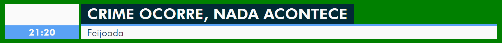

# PraçaTV Clone

Um clone[cópia] do gerador de caracteres (GC) utilizado nos telejornais regionais, implementado com Vue.



see also: praça tv vanilla JS

## Instalação

- `yarn` ou `npm install`
- git submodule init (ou algo assim)

## como faz pra rodar
- roda el socketito [puxão de orelha: vai ser automático]
- abre o `index.html` ou vai de ~~retro~~ `yarn serve` (ou `npm run serve`)


## Demonstração de comandos do Websocket
__ é controlado por meio de uma conexão WebSocket

### Atualizar título e descrição

```json
{
  "event": "overlay",
  "event_data": {
    "isRunning": true,
    "title": "Crime ocorre, nada acontece",
    "description": "Feijoada"
  }
}
``` 

### Alterar cores

```json
{
  "event": "color",
  "event_data": {
    "accent_color": "blue"
  }
}
```


## Project setup
```
yarn install
```

### Compiles and hot-reloads for development
```
yarn run serve
```

### Compiles and minifies for production
```
yarn run build
```

### Run your tests
```
yarn run test
```

### Lints and fixes files
```
yarn run lint
```

### Customize configuration
See [Configuration Reference](https://cli.vuejs.org/config/).
