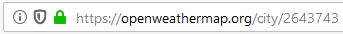

# PraçaTV Clone

Um clone do gerador de caracteres (GC) utilizado nos telejornais regionais da TV Globo (& afiliadas), implementado com Vue.


*veja também: [a mesma coisa, só que sem frameworks](https://github.com/lucaspontoexe/pracatv-vanilla)*

---


## Instalação
- `yarn` ou `npm install`


## Uso
- Tenha um servidor de WebSocket aberto na porta 9999 [(ou baixe esta extensão para Chrome)](https://chrome.google.com/webstore/detail/websocket-server-test/pkbpddppnkjmlbgliipgmhjeialadokj)
- Inicie com `yarn serve` ou `npm run serve`

### Outras opções
- Corrigir problemas de indentação e estilo: `yarn lint` ou `npm run lint`
- Compilar o projeto: `yarn build` ou `npm run build`

---

## Controle via Websocket
Por enquanto, o único jeito de interagir é enviando strings JSON pelo socket.

*qualquer coisa, é só baixar a extensão, rodar o projeto, pegar um desses blocos de código, colar na caixa de texto da janela e ver o que acontece*

### Atualizar título e descrição

```json
{
  "event": "overlay",
  "event_data": {
    "isRunning": true,
    "title": "Crime ocorre, nada acontece",
    "description": "Feijoada"
  }
}
``` 

### Alterar cores

```json
{
  "event": "color",
  "event_data": {
    "accent_color": "blue"
  }
}
```

## Widget do Clima
Apresenta o nome da cidade, temperatura e um ícone representando sua condição climática.
Os dados são carregados de uma API, mas caso você não queira criar uma chave de acesso, pode-se usar dados fictícios.

### Configuração

1. Crie uma conta em [openweathermap.org](https://openweathermap.org)
2. Você receberá sua chave por email. A ativação leva algumas horas.
3. Enquanto isso, pesquise [nesse endereço](https://openweathermap.org/find) cada cidade que você queira incluir
4. o WOEID está no endereço da página

5. Siga as instruções do arquivo `properties.example.js`

*to do: detalhar como configurar o widget sem precisar da api*

---

*Q: mas logo Vue em pleno século 2019? 11 em cada 10 empresas recomendam quem usa React™!*

Vue foi o framework que eu achei mais confortável pra começar, mas React não é um bicho de sete cabeças.
